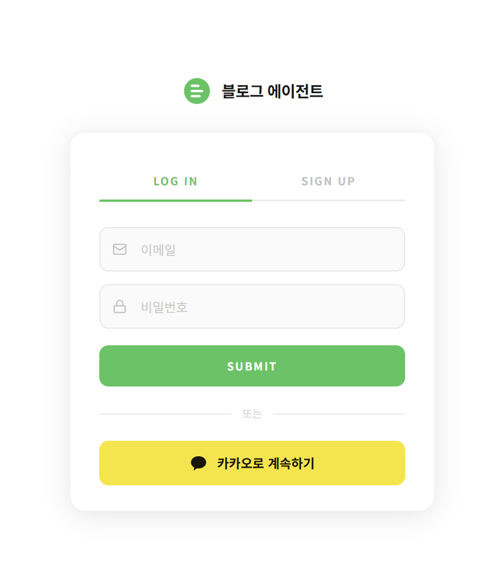
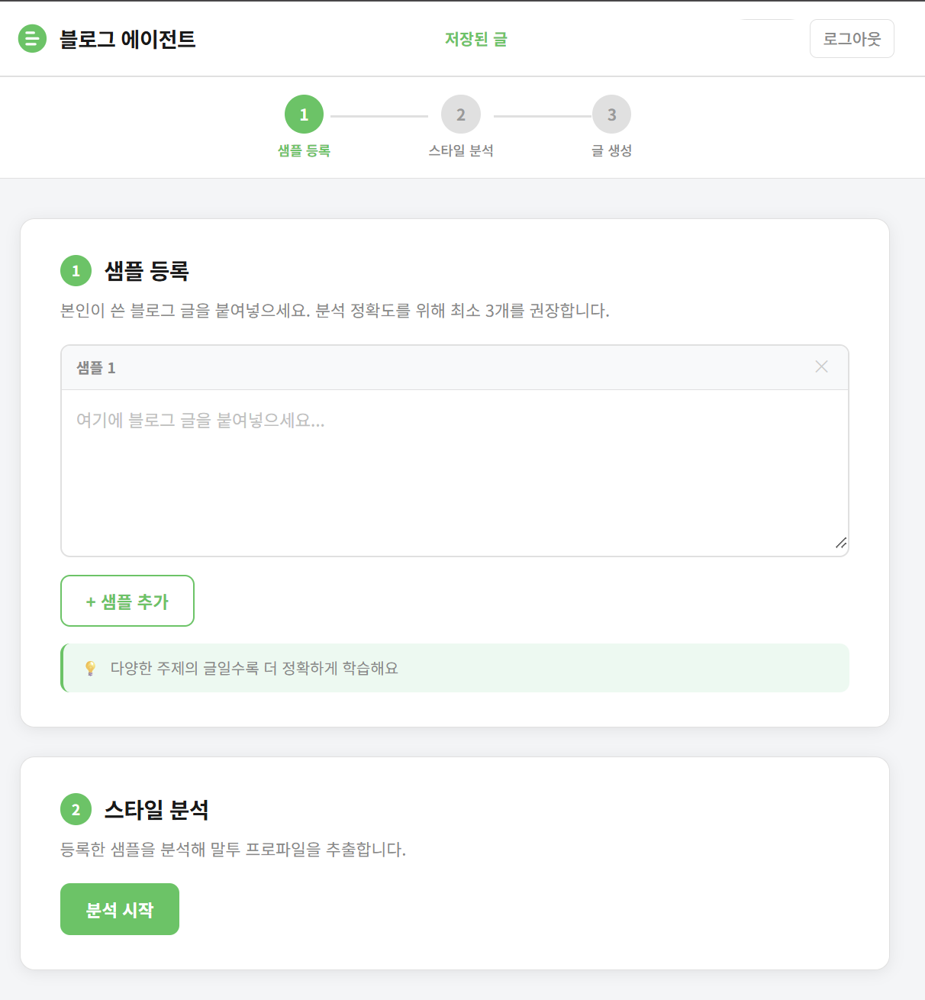

# 블로그 에이전트

개인 말투를 학습해 자동으로 블로그 글을 생성해주는 AI 웹 서비스

**배포:** https://blog-agent-production-0ffd.up.railway.app

## 스크린샷




## 주요 기능

- **말투 학습**: 본인이 쓴 블로그 샘플을 분석해 어조, 어미, 문장 패턴 등 개인 말투 프로파일 추출
- **블로그 글 생성**: 가게 정보와 사진을 입력하면 학습된 말투로 블로그 글 자동 생성
- **사진+글 인터리빙**: 업로드한 사진 사이사이에 글이 자연스럽게 배치되는 구조 생성
- **템플릿 모드**: 외부/내부/디테일 사진을 카테고리별로 구분해 섹션별 구조화된 리뷰 생성
- **블로그 제목 자동 추천**: 생성된 글 내용을 바탕으로 MZ 감성 블로그 제목 추천
- **임시저장**: 글 생성 페이지 입력 내용을 Supabase에 자동 저장, 재방문 시 복원
- **결과 인라인 편집**: 생성된 글을 결과 페이지에서 바로 수정 가능
- **글 저장/관리**: 생성한 글을 저장하고 히스토리에서 조회/삭제
- **말투 프로파일 관리**: 저장된 프로파일 속성 직접 편집 및 재사용
- **카카오 로그인**: Kakao OAuth 2.0 소셜 로그인, 사용자별 데이터 완전 분리

## 기술 스택

| 분류 | 기술 |
|------|------|
| Frontend | HTML, CSS, Vanilla JavaScript |
| Backend | Node.js, Express |
| AI | Anthropic Claude API (claude-sonnet-4-6) |
| 외부 API | 네이버 Local Search API (장소 검색) |
| 데이터베이스 | Supabase (PostgreSQL) |
| 인증 | Kakao OAuth 2.0 + express-session |
| 보안 | Helmet (CSP), express-rate-limit |
| 배포 | Railway |

## 시작하기

```bash
npm install
npm run dev
```

### 환경변수 (.env)

```
ANTHROPIC_API_KEY=
PORT=3000
NAVER_CLIENT_ID=
NAVER_CLIENT_SECRET=
SUPABASE_URL=
SUPABASE_ANON_KEY=
KAKAO_REST_API_KEY=
KAKAO_CLIENT_SECRET=
KAKAO_REDIRECT_URI=        # 로컬: http://localhost:3000/auth/kakao/callback
SESSION_SECRET=
```
